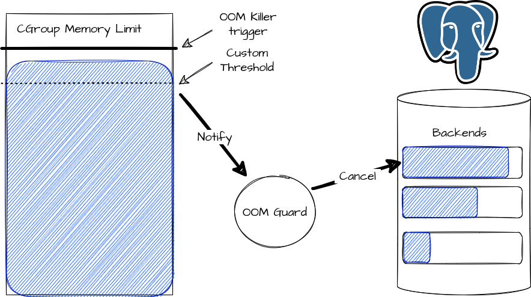

# go-oom-guard

It creates [eventfd](https://man7.org/linux/man-pages/man2/eventfd.2.html) and register a notifier by given [threshold](https://lwn.net/Articles/529927/) in CGroup.
Then it sends SIGINT or SIGTERM to top memory used process.



## Problem
Postgres is unable to control memory usage by backends.

CGroup OOM Killer triggered by some query causes whole database restart.

How to mitigate it?

## Possible solutions

1. Just monitor memory usage, make it less impact, [recommendations by CrunchyData](https://www.crunchydata.com/blog/deep-postgresql-thoughts-the-linux-assassin)
2. LD_PRELOAD custom library, [solution by TimescaleDB Cloud](https://www.postgresql.eu/events/pgconfde2022/sessions/session/3692/slides/309/pgconf_de_2022_kliukin_talk.pdf)
3. Register cgroup memory event before OOM triggers. A lot of solutions, [for example Tencent Cloud](https://www.tencentcloud.com/document/product/457/38709)

This repo is example of #3

## Prerequisites

- Docker
- python3, psycopg2
- psql
- Go

## Demo
terminal #1:
```
$ make build
$ make docker
$ make docker-run
```
terminal #2:
```
$ docker exec -i postgres_oom_guarded ./go-oom-guard
```
terminal #3:
```
make test-oom-execute
make test-oom-parse
```

and the try it without running `go-oom-guard`, stop terminal #2, and run commands in terminal #3 again.

## Cautions
It's only POC, don't use it on production AS IS!

## TODOs
- how to get exactly postgres [backend's](https://www.interdb.jp/pg/pgsql02.html#:~:text=A%20backend%20process%2C%20which%20is,when%20the%20client%20gets%20disconnected.) pid ?

## Links

- https://www.kernel.org/doc/Documentation/cgroup-v1/memory.txt - see `9. Memory thresholds`
- https://man7.org/linux/man-pages/man2/eventfd.2.html